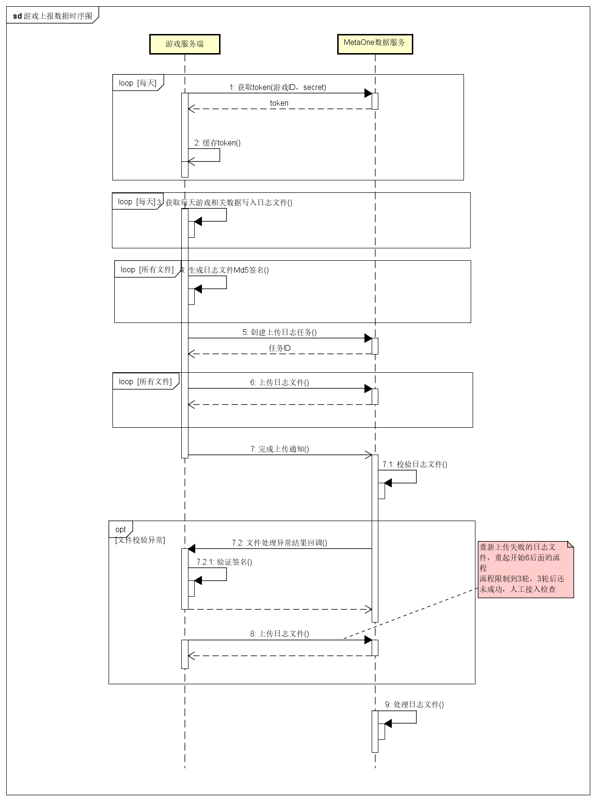

# MetaOne游戏对接文档

## 1 文档说明

-  本文档是数据分析模块 V1.0版本和智能合约租赁模块V1.0版本的说明。

- 文档主要为NFT游戏方提供对接使用，以便平台能够获得相应的游戏分析数据。

## 2 服务接入地址

- 测试环境：

  https://test-data.metaone.gg/sb/
  
- 正式环境：

  https://data.metaone.gg/sb/

## 3. 接口统一约束

### 3.1 统一请求数据结构

#### 3.1.1 请求头（Request Headers）：

- Accept-Language/lang：国际化语言【使用ISO标准的locale。不区分大小写，不区分横杠"-"与下划线"_"】
  - 英文：en或 en-US、en_uk等
  - 中文：zh或zh-cn、zh-hans、zh-hant、zh-hk、zh-tw、zh-sg等
- Authorization：应用全局唯一的动态接口调用凭据，也就是通过获取token接口返回的token。开发者需要每日获取更新并进行妥善保存。

### 3.2 统一返回数据结构

```json
{
    "stateCode": 1, // 业务返回状态码
    "resultInfo": { // 业务返回主体内容
        "desc": "Success",  // 返回内容描述
        "data": {}  // 业务返回数据
    }
}
```

- stateCode：
  - 1：请求成功
  - 0：参数格式相关错误
  - -1：token无效或过期
  - -5：服务端错误异常
  - -1105：无效的AppId
  - -1101：应用被封锁
  - -102：密钥不正确
  - -45：计算文件md5失败
  - -41：上传失败：文件太大
  - -40：上传失败：文件后缀名错误
  - -101：找不到对应数据
  - -7010：查询批次内文件错误
  - -7011：文件归属关系错误
  - -7012：文件名重复
- resultInfo.desc：
  - Success：请求成功
  - 其他：请求失败后的错误描述
- resultInfo.data：请求成功后的数据，注意，数据有可能为空

## 4 API接口

### 4.1 获取应用调用接口凭证-token

- 功能说明：获取token，token需要作为下面所有接口的认证信息带到请求头`Authorization`中。每一个应用(游戏)需要使用各自的token。

- 请求方式：POST

- 请求地址：/metaoneDataLight/getToken

- 请求内容：

  ```json
  {
  	"appId": "06be07ff82754a718a96ef46d1b82b2c", // 游戏应用ID，由metaone平台为每一个游戏颁发
  	"secret": "7531b58338104dcd9e7eddcce96c4ae0" // 秘钥，由metaone平台为每一个游戏颁发，注意：非常重要，不能泄露
  }
  ```

- 正确时响应内容：

  ```json
  {
      "stateCode": 1,
      "resultInfo": {
          "desc": "Success",
          "data": {
          	"token": "at_2a015a53d41548f5a6d7879b75a5fff3_gAP6sHl2xnh5WEWxgiFYUUfgXaPjtViY_mo",
          }
      }
  }
  ```
  
#### 应用调用接口凭证-token机制相关说明：

1. 建议开发者使用中控服务统一获取和刷新token，其他业务逻辑所使用的token均来自于该中控服务，不建议各自去getToken；
2. 目前token的有效期为24～48小时。中控服务每日固定时间通过计划任务等方式为每一个应用(游戏)各获取一次token，该token自getToken调用起算能够确保24小时内有效。在获取过程中，原有的token会在新token获取之后一段时间内仍然持续有效一小段时间，这保证了第三方业务的平滑过渡；
3. token的有效时间可能会在未来有调整，所以中控服务除每日定时主动获取当天的token以外，建议提供被动刷新token的接口，这样便于业务服务器在API调用获知token已超时的情况下，可以触发token的刷新流程。
4. 每一个应用(即游戏)都应该有自己的appId和secret。因此不同的游戏一定是使用各自的token去调用接口。数据同步接口会直接将token解析为对应的应用(游戏)，并将使用该token提交的数据全部强制归属于该应用(游戏)旗下。

### 4.2 创建上传日志任务

- 功能说明：游戏方在当天日志生成完后，上传日志前，需要按数据的类型创建上传日志的任务。
- 请求方式：POST
- 请求地址：/metaoneData/batch/create

- 请求内容：

  ```json
  {
      "bType": 1, //任务类型，整数。1-收益；2-在线时长；3-NFT信息；4-玩家总体数据
      "date": "2022-05-01", //yyyy-MM-dd格式的日期字符串。表示该数据所归属的日期
      "files": [ //预计在本次任务上传的文件列表【文件名不可重复】
      	{
      		"name": "player_data_file_22020501_001.log", //文件名
      		"md5": "8586ba5031e973d98c686883b3a2151f", //文件的md5值
      	},
      	{
      		"name": "player_data_file_22020501_002.log", //文件名
      		"md5": "8586ba5031e973d98c686883b3a2151f", //文件的md5值
      	},
      	...
      ]
  }
  ```

- 正确时响应内容：

  ```json
  {
      "stateCode": 1,
      "resultInfo": {
          "desc": "Success",
          "data": {
          	"batchId": "8586ba5031e973d98c686883b3a2151f", //任务ID
          }
      }
  }
  ```

### 4.3 上传日志文件
- 功能说明：游戏方将日志文件上传到MetaOne数据服务。
- 请求方式：POST 
- Content-Type：multipart/form-data
- 请求地址：/metaoneDataLight/uploadFile
- 请求头：除了统一请求头`Accept-Language`和`Authorization`外，还需要加入以下请求头

HeaderName | 是否必须 | HeaderValue说明
------- | ------- | -------
fileName | 是 | 文件名，需与创建任务时提交的文件列表中的一致
batchId | 是 | 任务ID，创建任务时获取的。该文件必须在该任务创建时的files内

- 请求体：

请求体为multipart/form-data的上传文件数据。参数名为"file"。

- 正确时响应内容：

  ```json
  {
      "stateCode": 1,
      "resultInfo": {
          "desc": "Success",
      }
  }
  ```

#### 上传日志文件相关说明：

1. 一次只支持一个大小不超过8MB的文件。为了确保容错率与降低上传接口一次请求连接过久造成阻塞。建议将数据文件拆分为大小相对较小【建议2MB以内】的小文件分别上传。某个小文件若上传报错可以进行重传
2. 不少主流的日志框架都支持按照设定的文件大小自动拆分日志文件，有条件的建议使用主流日志框架来获得最佳的实践方案。
3. 当整体数据较大时，每个日志文件相对较小，可能会导致文件数量较多。此时可以考虑将文件分组，分多次任务上传。metaone完全支持一天的数据拆分成多个任务分别上传的。
4. 所有日志文件建议游戏方自己保留备份一段时间【例如保留1个月】，以便事后发现一些需要人为介入处理的异常时开发者可以手动获取到可靠的原始数据便于数据修正

### 4.4 完成上传通知
- 功能说明：一个上传任务下的文件全部通过上传接口上传成功后【或补传文件都完成之后】，调用这个接口会触发metaone针对该任务的验收流程【验收流程是异步的。游戏应用方调用notify接口仅实现触发就会立即断开，不会因为等待验收流程造成阻塞】。验收流程异步执行完成后，metaone会将结果【成功、或失败(并附上需要重传的文件列表)】发送到应用开发者提供的结果回调接口【见4.1】
- 请求方式：POST/GET均兼容
- 请求地址：/metaoneData/batch/notify


- 请求参数：

```json
{
	"batchId" : "8586ba5031e973d98c686883b3a2151f" // 已完成各个文件上传的任务ID
}
```


- 正确时响应内容：

  ```json
  {
      "stateCode": 1,
      "resultInfo": {
          "desc": "Success",
      }
  }
  ```

## 5 回调接口

### 5.1 文件处理异常结果回调
- 功能说明：应用开发者服务端需要向metaone提供一个回调地址url。metaone在收到该应用的上传任务通知【通知接口见3.4】后，触发异步执行验收流程【校验文件的完整性、md5比对等】。验收流程异步执行完成后，metaone会将结果【成功、或失败（并附上需要重传的文件列表）】发送到应用开发者提供的结果回调接口。

- 请求方式：POST application/json

- 请求头：

HeaderName | HeaderValue说明
------- | -------
nonce | 每次回调请求都不一样的32位随机英文字符串
timestamp | 回调发起的时间戳（单位毫秒）长整型
signature | 请求签名。应用开发者对回调请求来源有安全性要求时，可以参考(metaone签名验证)对该签名进行验证

- （验收通过时）请求内容：

  ```json
  {
      "appId" : "06be07ff82754a718a96ef46d1b82b2c", //游戏应用ID
      "batchId" : "8586ba5031e973d98c686883b3a2151f", //任务ID
      "successFileCount": 200, //该任务的文件数量
      "errorFileCount":0,
  }
  ```

- （验收不通过时）时请求内容：

  ```json
  {
      "appId" : "06be07ff82754a718a96ef46d1b82b2c", //游戏应用ID
      "batchId" : "8586ba5031e973d98c686883b3a2151f", //任务ID
      "successFileCount": 197, //该任务校验通过的文件数量
      "errorFileCount":3, //该任务校验不通过、需要重新上传的文件数量
      "errorFileNames": [ //该任务下校验未通过，需要重新上传的文件名列表
      	"player_data_file_22020501_071.log",
      	"player_data_file_22020501_089.log",
      	"player_data_file_22020501_177.log"
      ]
  }
  ```

#### 处理异常结果回调相关说明：

1. 关于安全性问题：batchId是当前任务一次性的ID。该ID的正确性本身直接作为验证来源正确性的判断依据，正常已经足够。应用开发者在创建任务之后应保存创建的batchId。并以bathId的正确性作为回调来源的任务by任务的安全验证。可以忽略请求头中的签名
2. 若应用开发者对回调来源安全性有较高的要求，metaone在发送回调的请求头中会有可供校验的签名信息。具体签名算法见(metaone签名验证)。

#### metaone签名验证：

metaone签名验证计算方式如下：

Step1：按如下顺序拼接字符串：
```
batchId=$batchId&nonce=$nonce&timestamp=$timestamp#$signKey
```
其中：
- \$batchId即本次回调的batchId
- \$nonce会在请求头中提供，每次回调都不一样。一般是32位英文字母
- \$timestamp也会在请求头中提供，为毫秒为单位的时间戳。接受时若发现该时间戳与当前时间相差太大，也可以视为不安全的请求
- \$signKey为签名密钥，由metaone为游戏应用开发者颁发，同一个开发者旗下的多个游戏可以共用同一个签名密钥。该签名密钥仅用于此处签名回调。请注意跟获取token的高敏感密钥secret进行区分。
- 注意参与签名的主体queryString部分【batchId、nonce、timestamp】跟签名密钥之间有一个"#"
- 注意timestamp中间的s是小写的。但batchId中间的I是大写的。请注意签名对大小写敏感

Step2：计算签名(SHA256)
将Step1拼接得到的字符串计算sha256值【64个小写英文字母哈希值字符串】作为头部的signature值发送

示例：

| 字段 | 示例取值 | 说明
------- | ------- | -------
nonce | 2a015a53d41548f5a6d7879b75a5fff3 | 32位的随机字符串，每次回调都不一样
timestamp | 1648633838499 | 标准时间戳，单位为毫秒<br/>示例这里对应北京时间2022年3月30日17:50:38.499；<br/>即UTC时间2022年3月30日09:50:38.499
batchId | 8586ba5031e973d98c686883b3a2151f | 任务ID
signKey | 8912b624875d4533afee54d37648113a | 签名密钥


以上参数为例，拼装字符串如下：
```
batchId=8586ba5031e973d98c686883b3a2151f&nonce=2a015a53d41548f5a6d7879b75a5fff3&timestamp=1648633838499#8912b624875d4533afee54d37648113a
```
计算可以得到，该例子对应的signature为：
```
851bf483610ea88d5e975c482ffe6b0f6fef43db1df4804bd76e4155f8ef0b9f
```


## 6 游戏日志数据格式

### 6.1 日志通用数据描述

1. 所有数据以一行一条记录的方式存储在日志文件内。同一条记录内若数据内容包含换行，请确保转义为\n。避免一条数据中断为多行。

2. 每一行数据按如下格式存储：
```
自定义的日志开头[DATA!]数据内容[!DATA]自定义的日志行尾
```
自定义的日志开头和自定义的日志行尾可以不设置，也可以按照开发者自己的日志习惯去设置，metaone解析时会忽略这两个部分。而是读取每一行的[DATA!]到[!DATA]之间的数据内容。

例如：
```
[22/03/30 18:19:07.371]INFO [DATA!]{"a":"b","c":"X\nD"}[!DATA] [metaone_lib::cli_lib::main:metaone-lib/src/cli_lib/main.rs:10]
```
如果其中文件的其中一行如上所示，那么metaone只会解析 {"a":"b","c":"X\nD"} 这个部分
开发者完全可以根据自己日常的日志习惯设置前后格式内容。然后直接将 "[DATA!]" + 数据JSON内容 + "[!DATA]" 以一条日志的形式打到日志文件。

当然，若考虑到上传文件的性能问题。开发者也可以使用最精简的模式。不定义日志开头和行尾。每一行直接以如下格式写入文件。可以使得相同数据量情况下，文件大小最精简化。
```
[DATA!]{"a":"b","c":"X\nD"}[!DATA]
```

3. 数据内容部分为一个标准的紧凑型【无真换行、无缩进】json字符串。每种类型的任务对应的数据内容json字符串的具体字段有所差异，见【6.2数据内容格式说明】

### 6.2 数据内容格式说明：

- 注意1：数据对应的日期、具体哪款游戏、具体哪种类型。在创建任务时已经跟任务ID（batchId）绑定。上传的日志文件中不需要包含这些信息。即便包含了，也会被metaone忽略，metaone将严格按照创建任务时制定的日期、数据类型，以及token解码后得到的appId，强制将该任务下的所有文件的信息视为该日期、该类型、该游戏应用ID。【因此，游戏开发者请确保，同一个上传任务的文件内，只有该任务对应的游戏、日期和类型的数据】
- 注意2：所有的数据的文本编码使用utf-8。以避免两边编码不一致造成非英文字符出现乱码。
- 注意3：数据格式的字段在设计上都会尽可能缩略和精简。开发者在输出结果到数据文件时注意字段格式。

#### 类型1：玩家该日期的收益数据

```markdown
// 玩家新增收益
[DATA!]{"u":"玩家ID","i":"NFT道具ID","v":当日收益，整数}[!DATA]
```

- u：表示user，用户(玩家)的ID。字符串格式。
- i：表示item，用户持有的具体NFT道具的ID。字符串格式。
- v：表示value，表示该用户、该道具在该任务对用的游戏和日期当天的收益值。【以收益值的价值最小取整单位为单位(待确认)。以美元为例，最小单位为美分。】

#### 类型2：玩家该日期的在线时长

```markdown
// 玩家新增在线时长
[DATA!]{"u":"玩家ID","t":当日在线时长(单位:秒)，整数}[!DATA]
```
- u: 表示user，用户(玩家)的ID。字符串格式。
- t: 表示time，玩家在线时长，单位秒

#### 类型3：玩家NFT道具信息（具体业务属性格式可能还需更新）

```markdown
// 玩家新增一个NFT或玩家的一个NFT属性值发生变化
[DATA!]{"u":"玩家ID","i":"NTF道具ID","a":"overwrite","d":{最新的玩家道具属性细节}}}[!DATA]

// 玩家销毁、售卖了一个NFT
[DATA!]{"u":"玩家ID","i":"NTF道具ID","a":"delete"}[!DATA]
```

- u: 表示user，用户(玩家)的ID。字符串格式。
- i：表示item，具体道具的ID。字符串格式。
- a：表示action，取值为 "overwrite"和"delete"。"overwrite" 表示新增或更新该玩家在该道具的具体情况，同时也表示确认该玩家拥有该道具。"delete" 表示该玩家不再拥有该道具【已销毁、已售卖的等】

- d：表示details，当a="overwrite"时，必须提供完整的details属性：d内的具体字段如下：
```json
{
	"itemImage": "https://xxxx/xxx.png", //这是必选字段
	"gameID": "游戏ID", //这是必选字段
	"attributes" :[  //所有可选字段以如下格式放在attributes内
		{
			"attrName" : "字段的标题或名称", 
			"attrValue" : "字符串格式的字段取值", //所有类型的值都统一转为字符串
		},	
		{
			"attrName" : "字段的标题或名称", 
			"attrValue" : "字符串格式的字段取值", //所有类型的值都统一转为字符串
		},
		...
	]
}
```

以下举例：
```json
{
	"u" : "玩家ID/钱包ID",
	"i" : "NFT道具ID/tokenId",
	"a" : "overwrite",
	"d" : {
		"itemImage": "https://xxxx/xxx.png",
		"gameID": "游戏ID", 
		"attributes" :[ 
			{
				"attrName" : "weapon", 
				"attrValue" : "Weapon1234", 
			},	
			{
				"attrName" : "Talent Point", 
				"attrValue" : "3", 
			},
			{
				"attrName" : "Price In Game",
				"attrValue" : "1000 diamonds",
			},
			{
				"attrName" : "Rarity Level",
				"attrValue" : "SSR"
			}
		]
	}
}
```


#### 类型4：游戏每日玩家活跃情况整体数据

游戏玩家累计总数为全量数据，理论上每个游戏每天都只有一个只有一行内容的数据文件。

```markdown
// 玩家总数
[DATA!]{"a":该游戏当日上线的玩家人数,"t":该游戏累计玩家总数}[!DATA]
```
- a：表示activeUserCount，表示该游戏当日活跃(上线)的玩家人数
- t：表示totalCount，表示该游戏累计的玩家总数


## 7 业务时序图



- （流程1）获取token。游戏在对接时，MetaOne平台会颁发一个游戏ID和对应的密钥（secret），游戏方可通过密钥，每天定期获取token，并缓存起来（如redis等），以便后面业务接口的使用。引入token的目的是尽可能把密钥不泄露给更多的开发者。为了安全，建议游戏方单独一个服务处理token，甚至可以用该单独的服务作为请求转发。
- （流程3）游戏写日志文件可以采取两种方式，一种方案是可以将当天数据变动时写入日志文件（每个文件日志不能大于5M），另一种方案是第二天定时去写前一天数据。
- （流程6）游戏先创建上传任务后，上传日志文件失败时，游戏需要自主进行重传，直到上传成功为止。
- （流程7）一个任务中的所有文件上传成功后，游戏调用上传成功的通知接口，告诉数据服务可以启动处理处理流程。
- （流程7.1）数据服务在收到上传成功通知后，会逐个校验上传的文件（前期先校验文件是否完整，MD5是否正确，后续会校验内容的合法性）。
- （流程7.2）游戏方需要提供一个文件处理异常的回调接口，当数据服务在文件校验失败时，会调用该回调接口通知游戏，游戏需要根据接口返回进行游戏重传，后续的流程和第一次上传的流程一样。
- （流程9）数据服务进行数据的处理并存储。

## **8 NFT Lease**

### 8.1 角色

| **角色** | **说明**                                 |
| -------- | ---------------------------------------- |
| admin    | lease合约的管理员（钱包地址）            |
| lender   | 出租人（钱包地址）                       |
| renter   | 租用人（玩家钱包地址）                   |
| 游戏平台 | 中心化游戏平台                           |
| manager  | 管理员，参与从合约签名提币（ERC20token） |
| guild    | 公会 (分红与平台链下结算)                |

### 8.2 租赁模式

| **Rent**  **模式**（纯租金）                                 | **Staking** **模式（**租金+游戏奖励）                        |
| ------------------------------------------------------------ | ------------------------------------------------------------ |
| 租金：玩家钱包里的现金。  支持admin设置的ERC20token（包括USDT、metaone token、其它） | 租金：现金 + 游戏币（ERC20类型）  游戏奖励：每款游戏各自的奖励币（ERC20类型） |
| 租金计算：单位数量 现金/天 x 租借天数                        | 租金计算：  现金：单位数量 现金/天 x 租借天数  游戏币计算：游戏平台计算（给到游戏平台NFT地址、tokenID和租借时间段） |
| 支付方：renter                                               | 支付方：renter & 游戏平台                                    |
| 支付方式：形成租赁订单时，主动一次性支付给lease合约          | 支付方式：租期到后，将游戏币转入lease合约                    |
| 收益方：admin、lender                                        | 收益方：admin和公会、lender、renter                          |
| 提取方式：收益方发出提取申请，admin/manager手动发放          | 提取方式：收益方发出提取申请，admin/manager手动发放          |

### 8.3 租赁状态

| **状态**     | **描述**                                                 |
| ------------ | -------------------------------------------------------- |
| for_rent     | 可以被租赁                                               |
| rented       | 已被租（玩家发起租用后生效，包含使用前和使用中两种情况） |
| not_rentable | 不可被租赁，NFT在合约里                                  |
| empty        | NFT已被lender提出                                        |

### 8.4 游戏对接

#### 8.4.1游戏平台接收租赁数据

- 触发角色：游戏平台

- 简述

  - 游戏平台实时监听合约的Deposit事件
  - 根据event数据计算奖励

- 对接代码

  ```solidity
  event Rent(
  uint _lendItemID,
  address _NFTaddr,
  uint _tokenID,
  address _renter,
  uint _nowtime,
  uint _endtime,
  uint8 _gameBonus,
  uint _rentTimes)
  
  ```

  

#### 8.4.2 游戏平台奖励计算

- 触发角色：游戏平台
- 简述
  - Staking到期后，游戏平台计算游戏收益，记录并返回游戏奖励数据：
  - lendItemID，//租赁编号
  - tokenAddrt， //游戏币合约地址
  - amount此次租赁的奖金数
  - 服务端抓取，并记录这些数据
  - 游戏平台将奖励的ERC20token打入合约


## 文档更新日志

- 初始编写 [2022-3-30]
- 更新：增加智能合约对接API代码[ Lyon 2022-06-15 ] [内容来源：智能合约团队Hayley提供]


